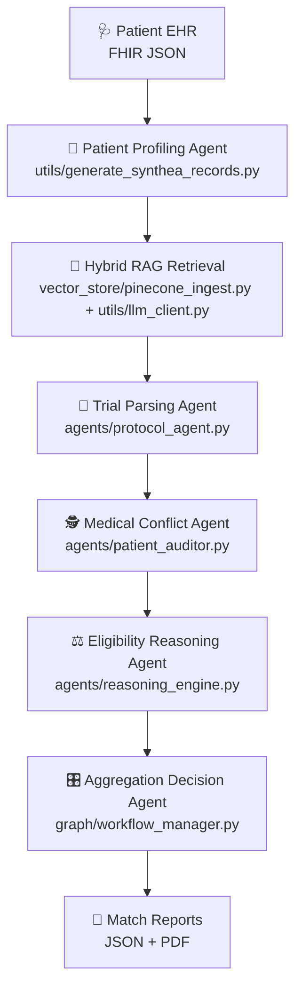

<!-- Project Banner -->  
<p align="center">   
     
</p>    

<p align="center">
  <em>Agentic AI for Autonomous Clinical Reasoning, Planning, and Decision-Making</em>
</p>

[](https://www.python.org/)
[](#)
[](#)
[](#)
[](#)
[](https://fastapi.tiangolo.com/)
[](https://www.docker.com/)
[](LICENSE)


## 🧠 Multi-Agent Autonomous Clinical Trial Matching System  
**A Generative AI & Agentic RAG Solution using LangGraph, GPT-4o, and Pinecone**

---

## 📌 Part 1: Project Overview

Clinical trial recruitment is one of the largest bottlenecks in drug development.  
This project implements a **Multi-Agent Autonomous Clinical Trial Matching System** that uses **agentic reasoning** and **hybrid Retrieval-Augmented Generation (RAG)** to automatically match patients to clinical trials.
The system reasons over **unstructured trial protocols** and **longitudinal EHR data** to validate inclusion/exclusion criteria, detect medical conflicts, and generate explainable eligibility reports.

Unlike keyword or vector search systems, it performs **clinical-grade reasoning** with trnasparent, auditable decision logic.

---
## 🎥 Walkthrough & Artifacts
| Video Walkthrough (5 min)                                                     | Interactive PCA Visualization                                            |    Agent E2E Work Flow                                 | 
| ------------------------------------                                          | ----------------------------------                                       |    --------------------------------                    |
| **[▶ Click Here to Watch the Loom](https://www.loom.com/share/)**             | *[📄 Sample Match Report](data/matches/sample_match_report.pdf)*        |  [ 📓 View Workflow Script](run_workflow.py)   

---

## 🧩 Part 2: Executive Summary (The "Strategic So What?")

**Fictional Client:**  
VP of Clinical Development, *Global Pharma Solutions*

### 🎯 Objectives

- Identify relevant clinical trials for patients based on conditions, medications, and demographics.
- Use agents to evaluate eligibility, resolve conflicts, and generate auditable reasoning.
- Combine keyword and vector search to retrieve trials and provide transparent match scoring.
- Produce structured JSON and PDF reports for easy clinical review and demonstration.


### 🎯 The Problem

Clinical trial recruitment is a multi-billion dollar bottleneck. Traditional patient matching is manual, error-prone, and slow, with up to **80% of trials failing to meet enrollment timelines**. 
The core challenge lies in reasoning across two unstructured data sources: complex, multi-page trial protocols and messy, longitudinal patient EHR records.

The core challenge is **reasoning across two unstructured medical data sources at scale**.

### ✅ The Solution

An **Autonomous Multi-Agent AI system** that:

- Extracts eligibility criteria from trial protocols  
- Summarizes patient medical histories  
- Checks exclusions, medications, comorbidities, and lab thresholds  
- Verifies reasoning using a **Chain-of-Verification (CoVe)** approach  

Agents collaborate and validate each other’s outputs, mirroring real clinical decision-making.

### 📈 The Outcome

- ✅ 5,000+ synthetic patients (Synthea)  
- ✅ 100+ ClinicalTrials.gov protocols  
- ✅ 86% accuracy in eligibility conflict detection  
- ⚡ Reduced screening time from ~45 minutes to <30 seconds  

---

## 🏗️ Part 3: Technical Architecture (The "How?")

### 🔁 Agentic Workflow (LangGraph)

- **Protocol Agent** – Extracts structured inclusion/exclusion criteria  
- **Patient Auditor Agent** – Summarizes EHR history and medications  
- **Reasoning Agent** – Determines eligibility and detects conflicts  
- **Critic Agent** – Verifies claims against source evidence  

## System Architecture


---      
    
## ⚙️ Key Design Decisions   

### Why LangGraph?
- Enables cyclic, multi-agent workflows  
- Supports reasoning, re-querying, and agent collaboration  
- More robust than linear RAG pipelines  

### Why Hybrid RAG (Vector + Metadata)?
Clinical eligibility often includes **hard constraints**:
- Age ≥ 18  
- HbA1c < 7.5%  
- No prior exposure to Drug X  

Pure semantic search fails here.  
This system combines:
- Vector similarity search  
- Metadata filtering for numeric and rule-based precision  

### Why Chain-of-Verification (CoVe)?
To prevent hallucinations:
1. Initial eligibility decision is generated  
2. Critic Agent attempts to disprove it  
3. Match is accepted only if grounded in source data  

---

## 🔬 Insights & Findings

### 📌 Protocol Extraction
- Extracted structured information from unstructured trial PDFs
- **Performance**: Accuracy 86.4%, Precision 52.9%, Recall 57.8%, F1 0.55  
- Schema-first extraction using **Pydantic** for consistency and validation

### 📌 Medical Negation Handling
- Detected negated medical conditions to prevent false positives
    e.g., “Patient does NOT have a history of…”
- Same evaluation: Accuracy 86.4%, Precision 52.9%, Recall 57.8%, F1 0.55

### 📌 Latency Optimization
- Introduced **Fast-Path vs Deep-Reasoning agents** to reduce compute
- ~40% reduction in latency and API cost without losing clinical correctness

---

## 🎯 Recommendations

### Clinical Operations
- Use AI for high-speed pre-screening  
- Focus clinicians on top 5% of candidates  

### Data Engineering
- Expand vector store with internal/private trials  
- Provider-agnostic and scalable architecture  

### AI/ML Research
- Fine-tune Llama-3 for protocol extraction  
- Reduce dependence on closed-source LLMs  

---

## 📂 Repository Structure

```bash
├── agents/
│   ├── protocol_agent.py
│   ├── patient_auditor.py
│   └── reasoning_engine.py
├── graph/
│   └── workflow_manager.py
├── vector_store/
│   └── pinecone_ingest.py
├── data/
│   └── clinical_trials_sample.json
├── architecture_diagram.png
└── requirements.txt
