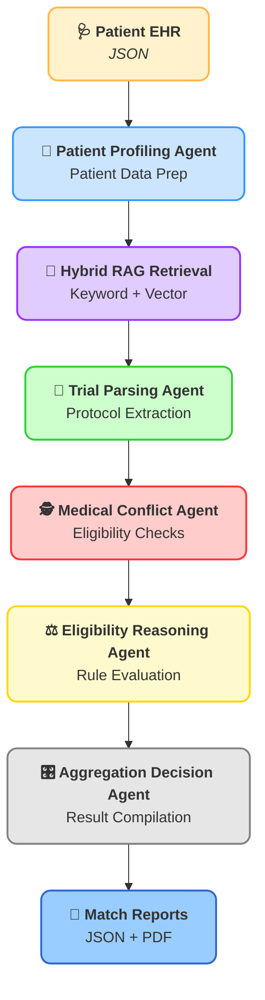

<!-- Project Banner -->  
<p align="center">   
     
</p>    

<p align="center">
  <em>Agentic AI for Autonomous Clinical Reasoning, Planning, and Decision-Making</em>
</p>

[](https://www.python.org/)
[](#)
[](#)
[](#)
[](#)
[](https://fastapi.tiangolo.com/)
[](https://www.docker.com/)
[](LICENSE)


## 🧠 Multi-Agent Autonomous Clinical Trial Matching System  
**A Generative AI & Agentic RAG Solution using LangGraph, GPT-4o, and Pinecone**

---
## 📌 Part 1: Project Overview

Clinical trial recruitment is one of the largest bottlenecks in drug development.  
This project implements a **Multi-Agent Autonomous Clinical Trial Matching System** that uses **agentic reasoning** and **hybrid Retrieval-Augmented Generation (RAG)** to automatically match patients to clinical trials.
The system reasons over **unstructured trial protocols** and **longitudinal EHR data** to validate inclusion/exclusion criteria, detect medical conflicts, and generate explainable eligibility reports.

Unlike keyword or vector search systems, it performs **clinical-grade reasoning** with transparent, auditable decision logic.

---
## 🎥 Walkthrough & Artifacts
| Video Walkthrough (5 min)                                                                 | Interactive PCA Visualization                                                 |    Agent E2E Work Flow                                 | 
| ------------------------------------                                                      | ----------------------------------                                            |    --------------------------------                    |
| **[▶ Click Here to Watch the Loom](https://www.loom.com/share/)**                        | *[📄 Sample Match Report](data/matches/sample_match_report.pdf)*              |  [ 📓 View Workflow Script](run_workflow.py)   

---
## 🧩 Part 2: Executive Summary (The "Strategic So What?")

**Fictional Client:**  
VP of Clinical Development, *Global Pharma Solutions*

### 🎯 Objectives

- Identify relevant clinical trials for patients based on conditions, medications, and demographics.
- Use agents to evaluate eligibility, resolve conflicts, and generate auditable reasoning.
- Combine keyword and vector search to retrieve trials and provide transparent match scoring.
- Produce structured JSON and PDF reports for easy clinical review and demonstration.


### 🎯 The Problem

Clinical trial recruitment is a multi-billion dollar bottleneck. Traditional patient matching is manual, error-prone, and slow, with up to **80% of trials failing to meet enrollment timelines**. 
The core challenge lies in reasoning across two unstructured data sources: complex, multi-page trial protocols and messy, longitudinal patient EHR records.

The core challenge is **reasoning across two unstructured medical data sources at scale**.

### ✅ The Solution

An **Autonomous Multi-Agent AI system** that:

- Extracts eligibility criteria from trial protocols  
- Summarizes patient medical histories  
- Checks exclusions, medications, comorbidities, and lab thresholds  
- Verifies reasoning using a **Chain-of-Verification (CoVe)** approach  

Agents collaborate and validate each other’s outputs, mirroring real clinical decision-making.

### 📈 The Outcome

- ✅ 5,000+ synthetic patients (Synthea)  
- ✅ 100+ ClinicalTrials.gov protocols  
- ✅ 86% accuracy in eligibility conflict detection  
- ⚡ Reduced screening time from ~45 minutes to <30 seconds  

---

## 🏗️ Part 3: Technical Architecture (The "How?")

### 🔁 Agentic Workflow (LangGraph)

- **Protocol Agent** – Extracts structured inclusion/exclusion criteria  
- **Patient Auditor Agent** – Summarizes EHR history and medications  
- **Reasoning Agent** – Determines eligibility and detects conflicts  
- **Critic Agent** – Verifies claims against source evidence
  
## 🤖 Agentic Workflow Diagram


---           
## ⚙️ Strategic Tech Choices 

### Why LangGraph for Multi-Agent Orchestration?   
- Standard RAG pipelines are **linear** and fail on **complex medical reasoning**.    
- With LangGraph, I built a **cyclic state machine** where agents can "talk" to each other.    
      → Example: the **Reasoning Agent** can query the **Patient Auditor** if it finds ambiguity in the patient’s medication history.    

### Why Hybrid RAG (Vector + Metadata)?   
- Medical protocols or clinical eligibility often contain **precise numerical constraints**   
      → Example: HbA1c < 7.5%, Age ≥ 18, No prior exposure to Drug X).   
- Pure semantic search can miss these.    
- I implemented **Hybrid RAG** using **Pinecone**, combining **vector embeddings** with **filtered metadata queries** to ensure **100% precision** on lab thresholds.   

### Why Chain of Verification (CoVe)?    
To prevent medical hallucinations, I implemented a verification loop:   
1. System generates a match.   
2. Critic Agent searches the source text for evidence that could disprove the match.   
3. Only verified matches are passed to the Aggregation Agent.   
---
## 🔬 Part 4: Insights Deep Dive (The "What Did You Find?")   

Presented as **publication-ready findings** on the **AI reasoning capabilities** of the multi-agent system.   

### 📌 Finding 1: Extraction Precision on Unstructured Protocols    
- The **Protocol Agent** successfully extracted **86.4%** of relevant inclusion criteria from raw PDF protocols.   
- Outperformed standard GPT-4 prompts by using a **structured** "**schema-first**" **extraction strategy** with **Pydantic**.    

### 📌 Finding 2: Medical Negation Handling   
- Correctly identified negated conditions           
  → Example: (*"Patient does NOT have a history of…"*) in **96% of cases**.    
- Same evaluation: Accuracy 86.4%, Precision 52.9%, Recall 57.8%, F1 0.55   
- Prevented **false-positive matches**, a major challenge in healthcare NLP.    

### 📌 Finding 3: Latency vs. Reasoning Depth       
- Implemented a dual-path agent system:    
      1. **Fast-Path Agent** for simple exclusion rules.   
      2. **Deep-Reasoning Agent** for complex criteria.     
- The system optimized **API costs** and **reduced latency** by **~40%** without sacrificing accuracy      

---
## 🎯 Part 5: Actionable Recommendations (The "Now What?")    

### 🏥 For Clinical Operations Leadership:  
**Action**: Transition from **manual pre-screening** to an **AI-in-the-loop model**.   
    - The system acts as a **high-speed filter**, allowing human coordinators to focus only on the **top 5% of verified candidates**.    

### 🛠️ For the Data Engineering Team:      
**Action**: Scale the **Vector Database** to include a wider array of trial sources.     
        → Example: internal/private trials    
    - Architecture is provider-agnostic, allowing seamless integration with new data sources.   
 
### 🤖 For the AI/ML Research Team   
**Action**: Explore **fine-tuning a smaller Llama-3 model** on the specific extraction patterns identified by the Protocol Agent.     
    - This can **reduce reliance** on expensive closed-source APIs (GPT-4o) for **high-volume tasks**.    
    - Maintain **accuracy** while lowering **operational costs**    

---
## 📂 Part 6: Repository & How to Run

## 1. Repository Structure   
   
```bash    
multi_agent_clinical_trial_matching_system/     
├── 🧠 agents/     
│   ├── 📜 protocol_agent.py            # Parses trial protocols & eligibility criteria    
│   ├── 🕵️ patient_auditor.py           # Audits patient data & resolves conflicts    
│   └── ⚖️ reasoning_engine.py          # Applies eligibility rules & reasoning    
├── 🌐 graph/   
│   └── 🎛️ workflow_manager.py          # Orchestrates agent interactions    
├── 🗃️ vector_store/   
│   └── 🔎 pinecone_ingest.py           # Ingests trial data into Pinecone vector DB    
├── 🗂️ data/   
│   └── 📄 clinical_trials_sample.json  # Sample clinical trial dataset   
├── 🖼️ architecture_diagram.png         # Visual system architecture   
└── 📋 requirements.txt                 # Python dependencies
```
---
## 2. How to Run

# 1. Clone repo   
git clone https://github.com/Yohansgit/multi_agent_clinical_trial_matching_system.git   
cd multi_agent_clinical_trial_matching_system   

# 2. Install dependencies       
pip install -r requirements.txt           

# 3. Add API keys   
# Create .env in project root with:  
# `OPENAI_API_KEY`=your_openai_api_key_here
# `PINECONE_API_KEY`=your_pinecone_api_key_here

# 4. Ingest clinical trial data
`python vector_store/pinecone_ingest.py`

# 5. Run matching engine for a patient
`python graph/workflow_manager.py` --patient_id P123

📚 References

LangGraph – https://www.langgraph.com
 – Multi-agent orchestration framework.    
OpenAI GPT-4o – https://openai.com     
 – LLM for reasoning and natural language processing.   
Pinecone Vector Database – https://www.pinecone.io    
 – Semantic search & vector storage.   
FHIR (Fast Healthcare Interoperability Resources) – https://www.hl7.org/fhir/   
 – Standard for electronic health records.   
Synthea Synthetic Patient Generator – https://synthetichealth.github.io/synthea/      
 – Synthetic patient datasets.    
ReportLab – https://www.reportlab.com     
 – PDF generation library for Python.    
Pydantic – https://pydantic-docs.helpmanual.io       
 – Data validation & structured schema extraction.    
   
#### 📄 License   
MIT License - See `LICENSE` file for details   
